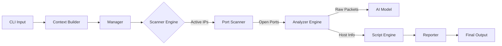

# 👻 PhantomSweep

### A Fast, Lightweight, Scalable & Smart Network Security Scanner


> **PhantomSweep** là công cụ quét mạng thế hệ mới, được thiết kế để kết hợp tốc độ của Masscan, tính linh hoạt của Nmap và sức mạnh của Trí tuệ Nhân tạo (AI). Dự án tập trung vào khả năng trinh sát mạng (network reconnaissance) tốc độ cao, khả năng mở rộng mạnh mẽ qua Plugin & Module Architecture, và các tính năng tích hợp AI như OS Fingerprinting with AI, Evasion with AI.

---

## 🎥 Demo

_[Chèn Link GIF hoặc Video Youtube Demo tính năng AI Evasion và Tốc độ quét tại đây]_

> _Xem video demo chi tiết tại: [Link Youtube]_

---

## 🚀 Tại sao chọn PhantomSweep?

PhantomSweep được xây dựng dựa trên 4 trụ cột công nghệ:

### ⚡ 1. Fast (Siêu tốc)

-   Sử dụng kiến trúc **Asyncio** kết hợp với **Raw Sockets** để loại bỏ các tầng overhead của hệ điều hành.
-   Hỗ trợ quét **Stateless** (tương tự Masscan) cho tốc độ lên đến hàng nghìn gói tin/giây.
-   Cơ chế **Pre-computed Packet Templates** giúp giảm thiểu chi phí CPU khi tạo gói tin.

### 🪶 2. Lightweight (Siêu nhẹ)

-   Tối ưu hóa bộ nhớ: Sử dụng **Generators** thay vì Lists để xử lý hàng triệu IP mà không tràn RAM.
-   Dependencies tối thiểu: Chỉ phụ thuộc vào các thư viện cốt lõi, dễ dàng chạy trên Raspberry Pi, Docker container hoặc các máy chủ tài nguyên thấp.

### 🧩 3. Scalable (Dễ mở rộng)

-   **Kiến trúc Plugin-based:** Dễ dàng thêm kỹ thuật quét mới (Scan Tech), định dạng báo cáo mới (Output), hoặc script kiểm tra lỗ hổng mới mà **không cần sửa Core**.
-   Cơ chế **Dynamic Loading**: Tự động phát hiện và nạp plugin từ thư mục cấu hình.

### 🧠 4. Smart (Thông minh)

-   **AI OS Fingerprinting:** Sử dụng mô hình Machine Learning (Random Forest) để nhận diện Hệ điều hành dựa trên đặc trưng TCP/IP (TTL, Window Size, DF bit...) với độ chính xác cao.
-   **AI Evasion (Reinforcement Learning):** Tự động điều chỉnh tốc độ (Rate) và độ trễ (Timing) để lẩn tránh sự phát hiện của IDS/IPS/Firewall (Đã bypass thành công một số cấu hình Suricata/Snort tiêu chuẩn).

---

## 🛠️ Cài đặt

PhantomSweep yêu cầu Python 3.8+ và quyền Administrator/Root (để sử dụng Raw Socket).

````bash
# 1. Clone repository
git clone [https://github.com/username/PhantomSweep.git](https://github.com/username/PhantomSweep.git)
cd PhantomSweep

# 2. Cài đặt dependencies
pip install -r requirements.txt

# 3. Cấp quyền thực thi (Linux/Mac)
chmod +x phantom.py
---

## 📖 Hướng dẫn sử dụng

Cấu trúc lệnh cơ bản:

```bash
python phantom.py [OPTIONS] --host <TARGET>
````

### 1\. Quét cơ bản (Nhanh & Hiệu quả)

Quét Top 100 ports, sử dụng ICMP Ping và TCP Connect Scan.

```bash
sudo python phantom.py --host 192.168.1.0/24
```

### 2\. Quét Tàng hình với AI (AI Stealth Scan)

Kích hoạt chế độ AI Evasion để tự động điều chỉnh hành vi quét, tránh bị chặn.

```bash
sudo python phantom.py --host 10.0.0.5 --scan-tech stealth --rate stealthy --evasion-mode ai
```

### 3\. Quét Toàn diện (Full Reconnaissance)

Kết hợp quét cổng, nhận diện OS bằng AI và xuất báo cáo JSON.

```bash
sudo python phantom.py --host scanme.nmap.org \
      --port top_1000 \
      --os-fingerprinting-mode ai \
      --output json --output-file report.json
```

### 4\. Chạy Custom Scripts

Kiểm tra các vấn đề bảo mật HTTP và FTP.

```bash
sudo python phantom.py --host 192.168.1.10 --script http_headers ftp_anonymous
```

---

## 🏗️ Kiến trúc Hệ thống

PhantomSweep hoạt động dựa trên mô hình Pipeline linh hoạt:



-   **Core:** Điều phối luồng dữ liệu.
-   **Plugins:** Chứa các module quét (ICMP, TCP SYN, UDP...) và các Script mở rộng.
-   **AI Engine:** Chứa các model đã huấn luyện (`.joblib`) để suy luận thời gian thực.

---

## 📊 So sánh Hiệu năng

| Tính năng                | Nmap                 | Masscan            | PhantomSweep              |
| :----------------------- | :------------------- | :----------------- | :------------------------ |
| **Kiến trúc**            | Multi-process/Select | Async/Ring Buffer  | **AsyncIO + Raw Sockets** |
| **Tốc độ (Large Scale)** | Thấp                 | Cực cao            | **Cao**                   |
| **Độ chính xác**         | Rất cao              | Thấp (hay mất gói) | **Cân bằng**              |
| **Khả năng mở rộng**     | Scripting (Lua)      | Hardcoded (C)      | **Python Plugins**        |
| **AI/ML Integration**    | Không                | Không              | **Có (Native)**           |

---

## 🤝 Đóng góp (Contributing)

Chúng tôi hoan nghênh mọi đóng góp từ cộng đồng\!

1.  Fork dự án.
2.  Tạo Feature Branch (`git checkout -b feature/AmazingFeature`).
3.  Commit thay đổi (`git commit -m 'Add some AmazingFeature'`).
4.  Push lên Branch (`git push origin feature/AmazingFeature`).
5.  Mở Pull Request.

---

## 📜 Giấy phép & Tuyên bố miễn trừ

Dự án này được phát hành dưới giấy phép **MIT License**.

**⚠️ CẢNH BÁO:** PhantomSweep là công cụ được thiết kế cho mục đích **giáo dục** và **kiểm thử bảo mật hợp pháp**. Tác giả không chịu trách nhiệm cho bất kỳ hành vi sử dụng sai trái nào vào các hệ thống không được ủy quyền.

---

**Developed with ❤️ by [Tên Nhóm/Team Name] - UIT**

````

---

## 💡 Mẹo để README trở nên "Xịn" hơn trong mắt Giảng viên

1.  **Video Demo là "Vũ khí tối thượng":**

    -   Giảng viên thường lười chạy code. Hãy dùng phần mềm quay màn hình (như OBS), quay cảnh bạn gõ lệnh:
        -   Cảnh 1: Quét bình thường.
        -   Cảnh 2: Bật `--evasion-mode ai` và bypass được một cái rule Firewall đơn giản (hoặc ít nhất là show log thấy AI đang tự đổi timeout).
    -   Up lên YouTube (Unlisted) hoặc convert sang file GIF chất lượng cao và gắn vào đầu bài.

2.  **Ảnh chụp màn hình (Screenshots):**

    -   Chụp lại output CLI khi quét xong.
    -   Nên dùng terminal có màu sắc (như Kali Linux terminal hoặc dùng thư viện `rich` để in màu) cho đẹp.
    -   Chụp cả file JSON report được sinh ra.

3.  **Cấu trúc thư mục:**

    -   Bạn có thể thêm một mục nhỏ hiển thị cấu trúc cây thư mục (dùng lệnh `tree`) để chứng minh kiến trúc Module của bạn là thật, không phải chém gió.
    -   Ví dụ:
        ```text
        phantom_sweep/
        ├── core/
        ├── plugins/
        │   ├── scanner/
        │   │   ├── icmp_ping.py
        │   │   └── tcp_syn.py
        │   └── scripts/
        └── models/
            └── os_detection_rf.joblib
        ```

4.  **Viết bằng tiếng Anh:**
    -   Đồ án công nghệ nên viết README bằng tiếng Anh để thể hiện tính chuyên nghiệp và sẵn sàng cho Open Source. (Bản mẫu trên tôi viết tiếng Việt để bạn dễ nắm ý, bạn có thể dịch sang Anh hoặc để song ngữ).

Chúc bạn hoàn thiện "cú chốt" Github này thật rực rỡ!

```

```
````
